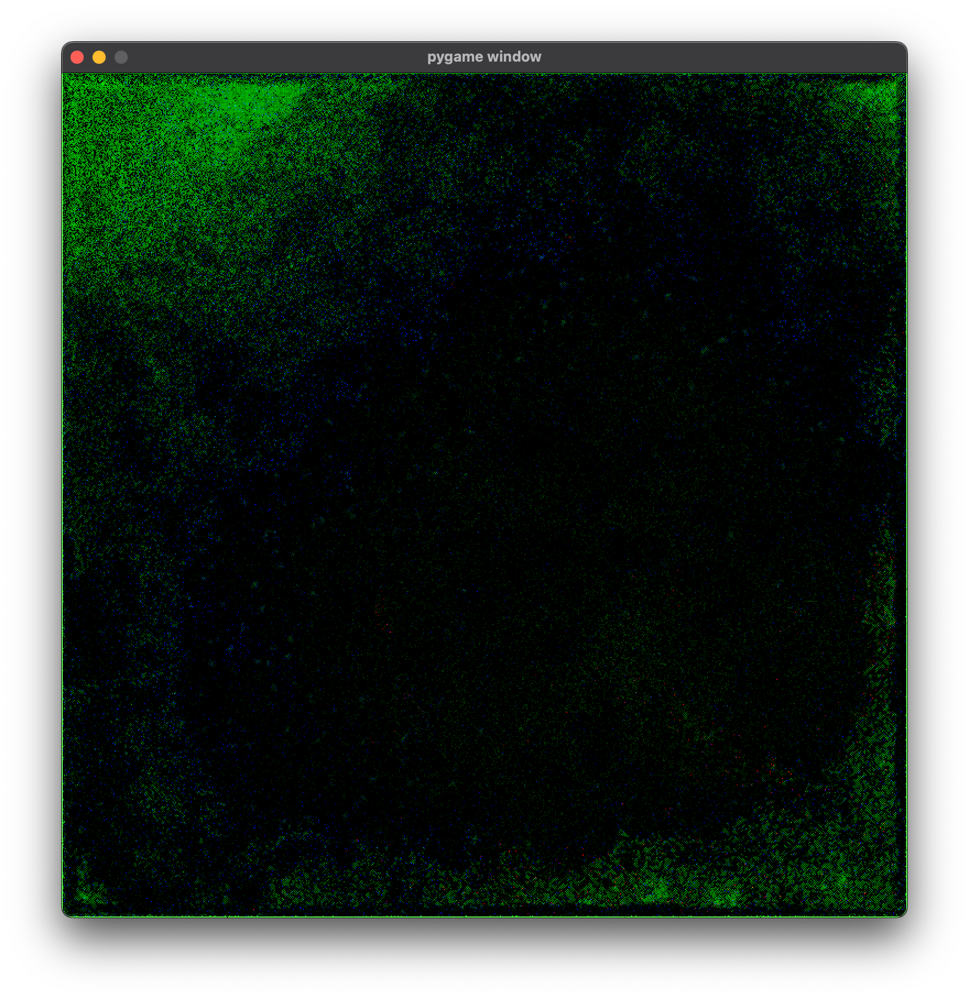

# Tensor Beasts
Tensor Beasts is an ecological simulation that runs mostly in `uint8` Torch
tensors.


This is cool because:

1. Performance of the base simulation isn't impacted by simulation state.
    Whatever performance you get when the simulation starts will be maintained.
2. The world state is already tensors, so it can be easily passed through a
    neural network.

## Setup

Set up [Poetry](https://python-poetry.org/docs/) if you haven't already.

From the root of this repository, run:
```bash
poetry install tensor-beasts
```

## Usage

Run the simulation with:
```bash
poetry run python -m tensor_beasts
```

CLI options:
```bash
usage: main.py [-h] [--size SIZE] [--device DEVICE]

Run the tensor beasts simulation

options:
  -h, --help       show this help message and exit
  --size SIZE      The size of the world. (default: 768)
  --device DEVICE  The device to use. (default: mps)
```

Once it's running, there are a few commands you can use:

- `n` to toggle the active screen.
- `+` to zoom in.
- `-` to zoom out.
- `h` to re-seed with herbivores.
- `p` to re-seed with predators.


## TODO

**UI**
- [ ] Add panning contorls.
- [ ] Add play, pause, and step controls.
- [ ] Add overlay views to put herbivores and predators on top of plants, scents.
- [ ] Parametrize all the constants.
- [ ] Add channel aliases in entity config. This way, for example, I could specify
    that `predator.food` is `herbivore.energy`. This will be useful if there are
    more species in the future.

**Simulation**
- [ ] Add obstacles.
- [ ] Non-linear scent diffusion. It should be hard to accumulate maximum scent,
    but also hard for it to completely dissapate.
- [ ] Add scent trails.
- [ ] Add wind and dynamic wind direction.
- [ ] Add non-uniform terrain. Heightmap? Nutrient map? Water map?
- [ ] Seasons?
- [ ] Rainfall? Watersheds?
- [ ] Add multiple kinds of plants.

**Performance**
- [ ] Refactor things to identify repeated calculations.
- [ ] Can move and eat be batched?
- [ ] Don't update inactive screens.