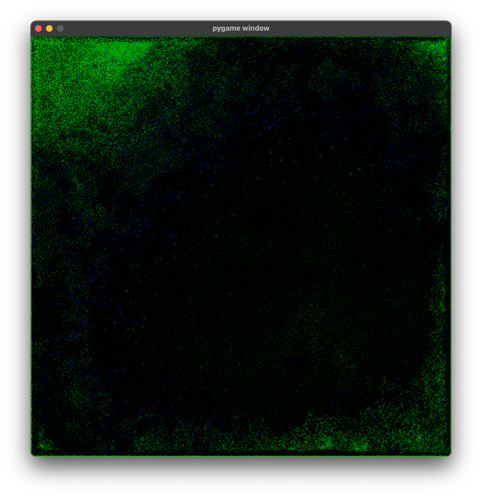

# Tensor Beasts
Tensor Beasts is an ecological simulation that runs entirely in Torch tensors.


This is cool because:

1. Performance of the base simulation isn't impacted by simulation state.
    Whatever performance you get when the simulation starts will be maintained.
2. The world state is already tensors, so it can be easily passed through a
    neural network.

## Setup

The repository ships a virtualenv. Everything below assumes it:

```bash
source venv/bin/activate
```

To build one from scratch instead, set up
[Poetry](https://python-poetry.org/docs/) and run `poetry install` from the
repository root.

## Usage

Run the simulation with:
```bash
python -m tensor_beasts
```

CLI options:
```bash
usage: main.py [-h] [--config_path CONFIG_PATH]

Run the tensor beasts simulation

options:
  -h, --help            show this help message and exit
  --config_path CONFIG_PATH
                        The path to the config file. (default: beast_config.yaml)
```

Once it's running, there are a few commands you can use:

- `n` to toggle the active screen.
- `+` to zoom in.
- `-` to zoom out.
- `h` to re-seed with herbivores.
- `p` to re-seed with predators.

## Configuration

Configs are strict and forward-only. Entity names must match class names exactly:
`Terrain`, `Plant`, `Herbivore`, `Predator`, `DiffusionToy`.

Display renderers must be explicit:
- `fn_name: default` requires `key`
- `fn_name: layered` requires `layers` with `key`, `threshold`, `color_min`, `color_max`, `input_range`
- `fn_name: cross_section` requires `background_color`, `screen_height`, `section_idx`, `section_dim`, `levels`


## Development tools

Three scripts at the repository root, all of which take `--help`:

```bash
python sim_bench.py golden        # hash world state; proves a change is behaviour-preserving
python sim_bench.py bench         # steps per second by world size and device
python evaluate_policy.py         # score a policy on herbivore survival
python sim_diagnostics.py         # per-step ecosystem stats
```

`sim_bench.py golden --check baseline_golden.json` exits non-zero if simulation
behaviour has drifted. Run it before and after any change meant to be a pure
refactor or optimization. When a hash is *supposed* to move, re-capture the
baseline in its own commit and say why, so behaviour changes stay visible in
review.

## Reinforcement learning

The experiment: **can a learned policy beat the rule-based policy at herbivore
survival?** The rule-based policy is not a strawman, so this is a real question.

```bash
python train_rl.py                          # train, then score against the baseline
python train_rl.py --arch dilated --size 512
python train_rl.py --eval-only outputs/rl/checkpoint.pt
python train_rl.py --metabolic-levels 4     # learn the metabolic rate as well as the direction
python sweep_rl.py --trials 16              # parallel hyperparameter search
python evaluate_policy.py --size 512        # score the baseline on its own
```

**Every living herbivore is its own agent**, all sharing one set of policy
weights, each with its own reward and its own episode from birth to death. A
shared policy over a spatial observation is a single convolutional forward pass,
so this costs nothing versus treating the world as one controller. The framing
and the reasoning behind it are in `planning/04-reinforcement-learning.md`; the
environment is `tensor_beasts/rl/multiagent.py`.

Algorithms are `ppo`, `vtrace` and `awr`; architectures are `linear`, `conv`,
`residual` and `dilated`. Three flags extend what the learner controls:

```bash
python train_rl.py --imitation-coef 1.0                  # anchor to the rule-based policy, fading out
python train_rl.py --metabolic-levels 4                  # learn the metabolic rate as well as direction
python train_rl.py --memory-size 4 --recurrent-window 8  # a per-individual memory, trained recurrently
```

The anchor is what first beat the baseline. The metabolic lever and the
memory are newer and their results are recorded honestly, including the
reward artefact that neutered the first metabolic run, in
`planning/04-reinforcement-learning.md`. `linear` is a diagnostic rather than a contender: it
can represent the rule-based policy exactly, so it tells you whether a failure
is in the setup or in the model.

The baseline to beat, five episodes of 600 steps at 512x512, in herbivore-steps
survived:

| Policy | Return | Final population |
|---|---|---|
| Rule-based | 1,082,723 | 4,634 |
| Random | 309,589 | 1,475 |
| Stay put | 60,539 | 0 by step 202 |

A learned policy has beaten it. A `conv` network trained at 256 with the
rule-based policy as a fading anchor beats the baseline at 512 by **11 to 33
percent** across five training seeds, mean 1.20x, on three paired evaluation
seeds over 400 steps; the best checkpoint held 1.155x over 1200 steps. The
same checkpoint with its metabolic rate pinned to basal scores **1.646x**: the
rule-based metabolism burns more than it needs: the rules themselves score
1.25x with their throttle pinned to basal, and the two effects multiply. See
`planning/04-reinforcement-learning.md` for the variance and the caveats.

**Size matters more than anything else here.** Below roughly 256 the predator
population goes extinct and the three-species dynamic degenerates, so a small
world is a different problem rather than a cheap version of this one. Use 256
for iteration and 512 for results.

To watch a learned policy in the interactive viewer instead of reading numbers
about it:

```bash
python -m tensor_beasts --policy outputs/rl/conv_imitation2/checkpoint.pt
python -m tensor_beasts --policy <checkpoint> --deterministic   # its clearest intent
```

Herbivores are then driven by the checkpoint and everything else runs as
normal; the stats printed each frame say which policy is in charge. Use the
config the policy was trained on, which for the checkpoints here is the default
`conf/basic_config.yaml`.

`tensor_beasts/rl/envs/world_environment.py` is a separate, single-controller
Gymnasium environment, kept for off-the-shelf algorithms that expect that API.

## TODO

**UI**
- [ ] Add panning contorls.
- [ ] Add play, pause, and step controls.
- [ ] Add overlay views to put herbivores and predators on top of plants, scents.
- [ ] Parametrize all the constants.
- [ ] Add channel aliases in entity config. This way, for example, I could specify
    that `predator.food` is `herbivore.energy`. This will be useful if there are
    more species in the future.

**Simulation**
- [ ] Make the herbivore population sustain rather than decline. It falls from
    91 to roughly 40 over a few hundred steps at 128x128 even under the
    rule-based policy.
- [ ] Keep predators alive. They go extinct by roughly step 200 on
    `basic_config.yaml`.
- [ ] Add obstacles.
- [ ] Non-linear scent diffusion. It should be hard to accumulate maximum scent,
    but also hard for it to completely dissapate.
- [ ] Add scent trails.
- [ ] Add wind and dynamic wind direction.
- [ ] Add non-uniform terrain. Heightmap? Nutrient map? Water map?
- [ ] Seasons?
- [ ] Rainfall? Watersheds?
- [ ] Add multiple kinds of plants.

**Performance**
- [ ] Refactor things to identify repeated calculations.
- [ ] Can move and eat be batched?
- [ ] Don't update inactive screens.


8/15:
- [ ] Support dynamic screen sizes.
- [ ] Slice view.
- [ ] Control panels for live param changes.
